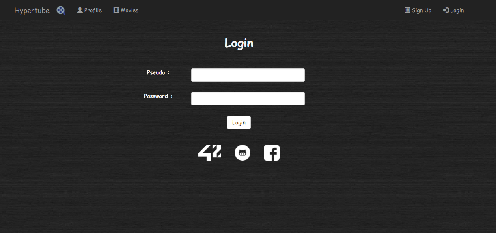
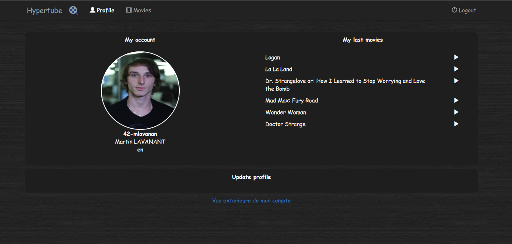
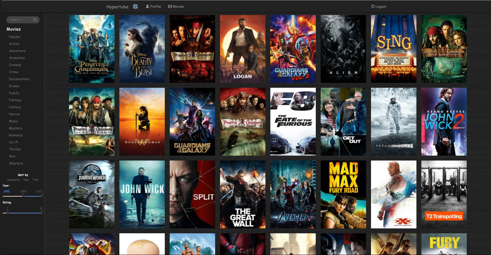
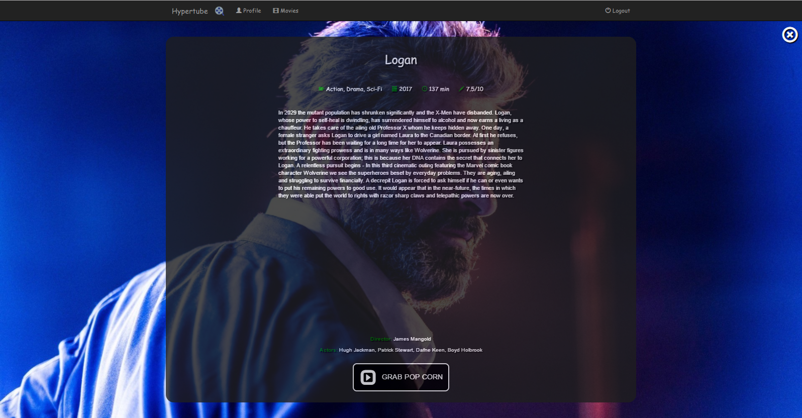
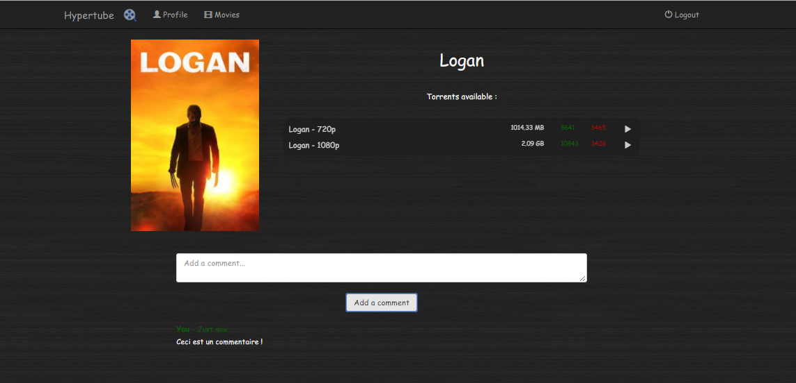

# Hypertube

**The best way to watch movies !!**

Hypertube is a 42 school project, consisting of creating a website where you can log on using various omniAuth then select a movie and watch it as it is being downloaded.

**Hypertube is a single page application website, made using the MEANstack, organised as an apiREST**

**Login with OmniAuth :**

**Profile with history :**

**Movie research :**
You can search by name, genre, date, and rating !
watched movie are highlighted in green !

**Movie info :**

**Torrent selection :**
with comments !

Now you can watch your movie as it is downloaded !!

Voila !